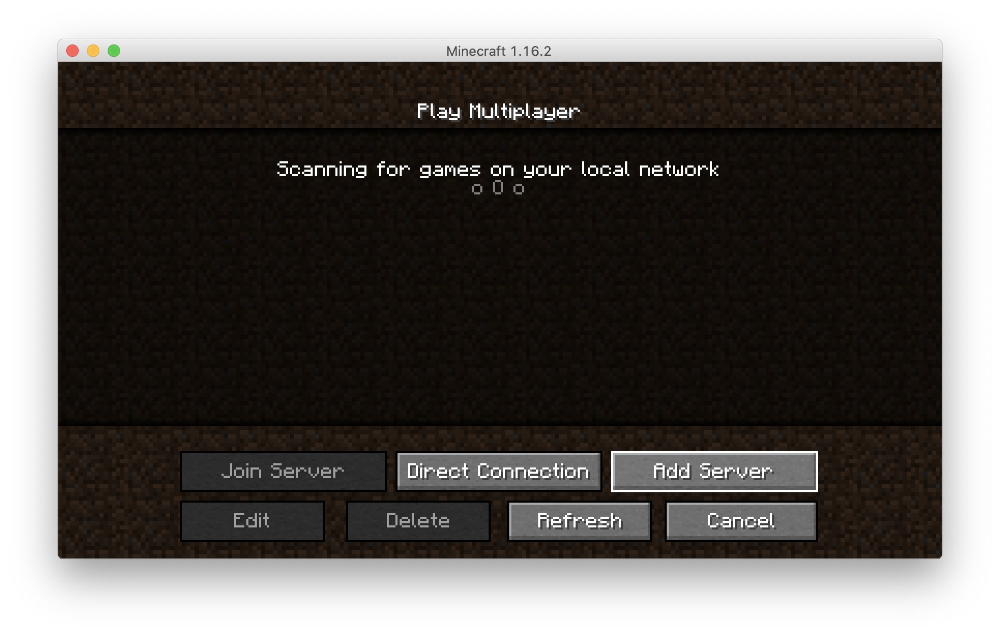
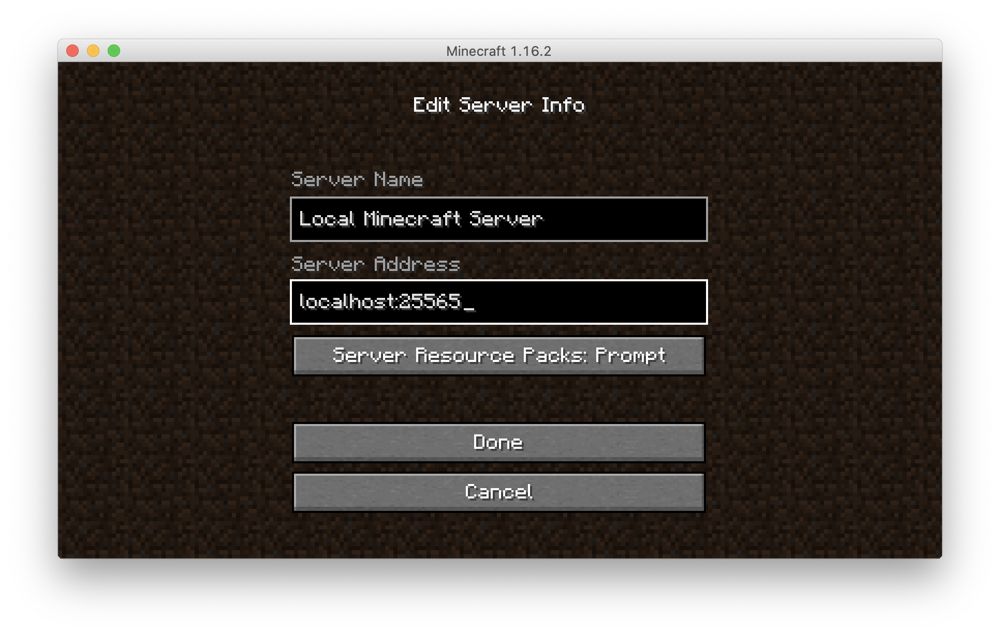
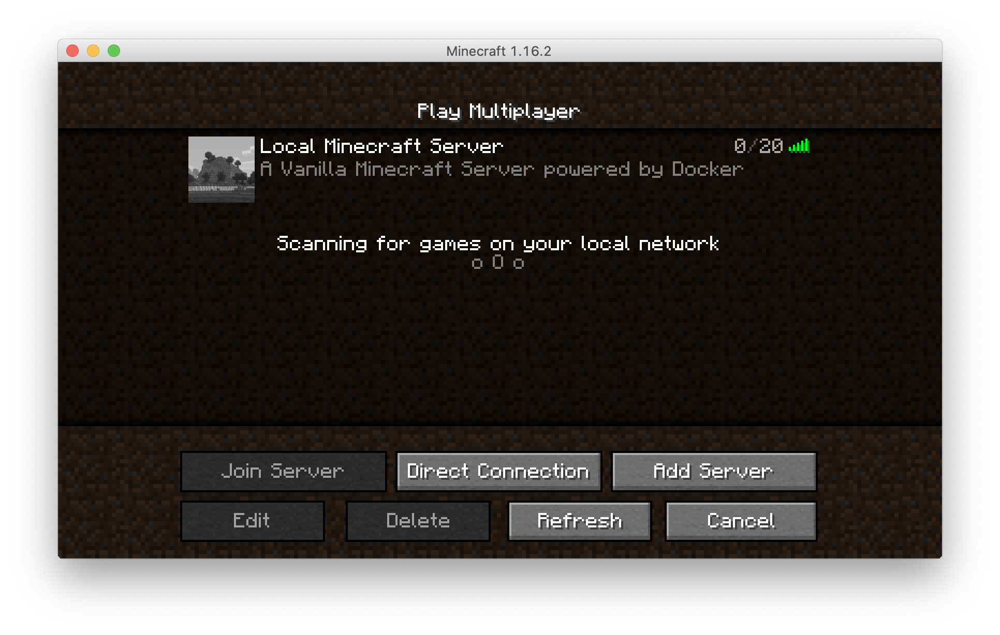

# Minecraft server

[Minecraft](https://www.minecraft.net/en-us) is a sandbox video game developed by Mojang Studios. It allows players to build and explore virtual worlds made up of blocks.

**Credits**: This example is based on this [Minecraft Docker Compose example](https://github.com/docker/awesome-compose/tree/master/minecraft).

## Building

Because of quota limitations, you might not be able to instantiate VMs with more than 2G of RAM. This image is pretty
heavy, and using the traditional `initrd` approach will not work because of the size of the image. Thus, we will
create an `erofs` filesystem image from the Docker image, to bypass the memory consumption of unpacking into RAM on startup.
This approach will be automated in the near future, but for now, you can follow these steps to create the `erofs` filesystem image:

1. **Navigate to the image directory**

   ```bash
   cd image
   ```

2. **Extract the original image env**

    ```bash
    ./extract-env.sh
    ```

    This will create a `minecraft_env.txt` file containing the environment variables from the original Docker image.

3. **Build the Docker image**

   ```bash
   docker build -t minecraft-with-wrapper .
   ```

   The resulting image will contain a `wrapper.sh` script that will inject the necessary environment variables embedded into the original image and run the original entrypoint.

4. **Export the container filesystem**

   ```bash
   docker create --name temp-minecraft minecraft-with-wrapper
   docker export -o rootfs.tar temp-minecraft
   docker rm temp-minecraft
   ```

5. **Create the erofs filesystem image**

   ```bash
   mkdir rootfs
   tar -xvf rootfs.tar -C rootfs
   mkfs.erofs --all-root -d2 -E noinline_data rootfs.erofs ./rootfs
   ```

6. **Clean up temporary files**

   ```bash
   rm -rf rootfs/ rootfs.tar
   cd ..
   ```

## Deployment

This example uses a [`compose.yaml`](compose.yaml) file to define the Minecraft server service.

To run it on Unikraft Cloud, first [install the `kraft` CLI tool](https://unikraft.org/docs/cli). Make sure you have an active account on Unikraft Cloud (UKC) and that you have authenticated your CLI with your UKC account.

```bash
export UKC_TOKEN=<your-unikraft-cloud-access-token>
export UKC_METRO=fra0
```

Then `cd` into [this](.) directory, and invoke:

```bash
kraft cloud compose up
```

This will create an instance with the name `minecraft`.
Because of a current limitation, Unikraft Cloud only supports exposing HTTP services. As a workaround, you
can use `socat` to forward the Minecraft server port, or create a tunnel like this:

```bash
kraft cloud tunnel minecraft:25565
```

## Playing

Once the server is initialized, run your Minecraft application (it needs to be the latest current stable version), hit "Multiplayer" and "Add server"


Connect to `localhost:25565` (assuming you created a tunnel)


You can then start playing


## Volume

This deployment creates a volume for data persistence: `minecraft-data` for the Minecraft server.
Upon bringing down the service (e.g., `kraft cloud compose down`), this volume will persist, allowing you to bring the service back up without losing data.
To remove the volume, you can use:

```bash
kraft cloud volume rm minecraft-data
```

## Learn more

- [Minecraft Official Website](https://www.minecraft.net/en-us)
- [Minecraft Wiki](https://minecraft.fandom.com/wiki/Minecraft_Wiki)
- [Awesome Compose](https://github.com/docker/awesome-compose)
- [Unikraft Cloud's Documentation](https://unikraft.cloud/docs/)
- [Building `Dockerfile` Images with `Buildkit`](https://unikraft.org/guides/building-dockerfile-images-with-buildkit)
- [Deploying with Compose Files](https://unikraft.cloud/docs/guides/features/compose/)
- [Creating tunnels](https://unikraft.cloud/docs/guides/features/tunnel/)
